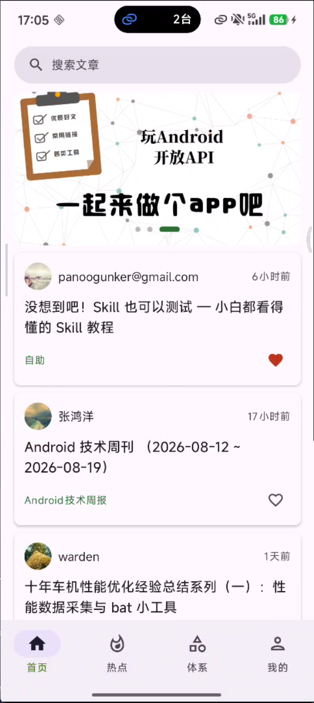
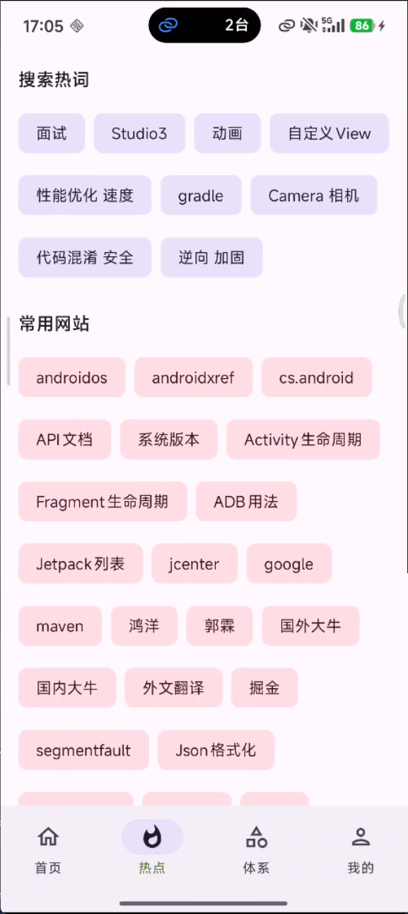
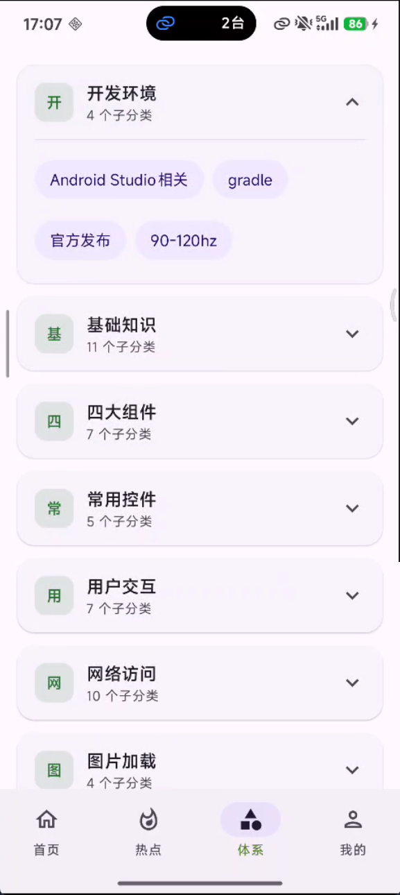
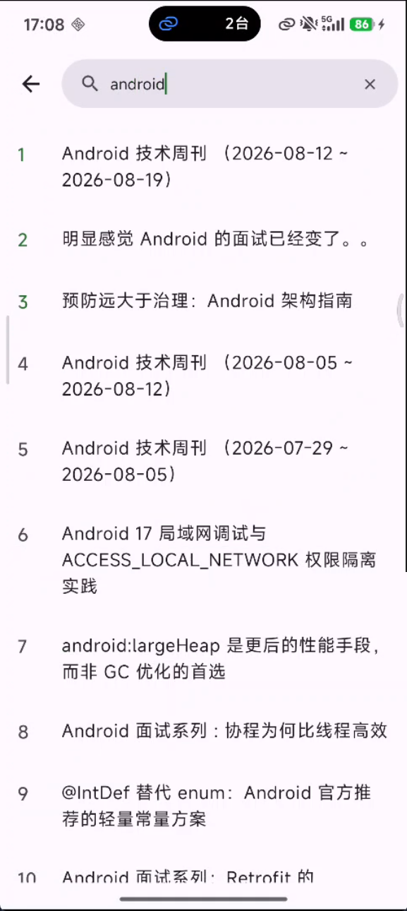
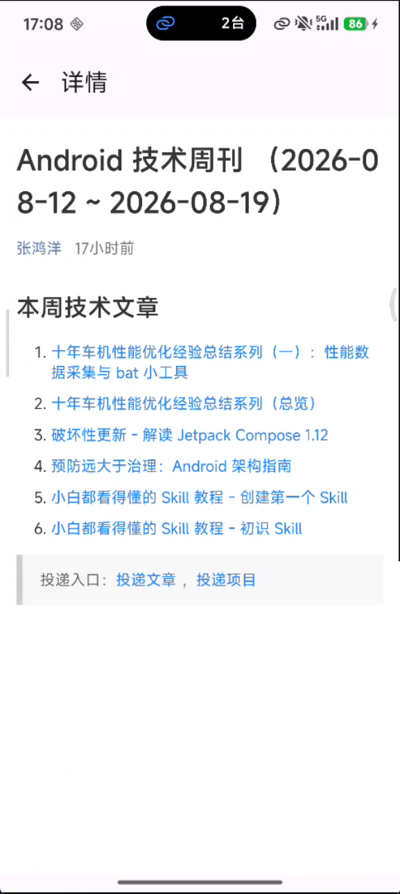
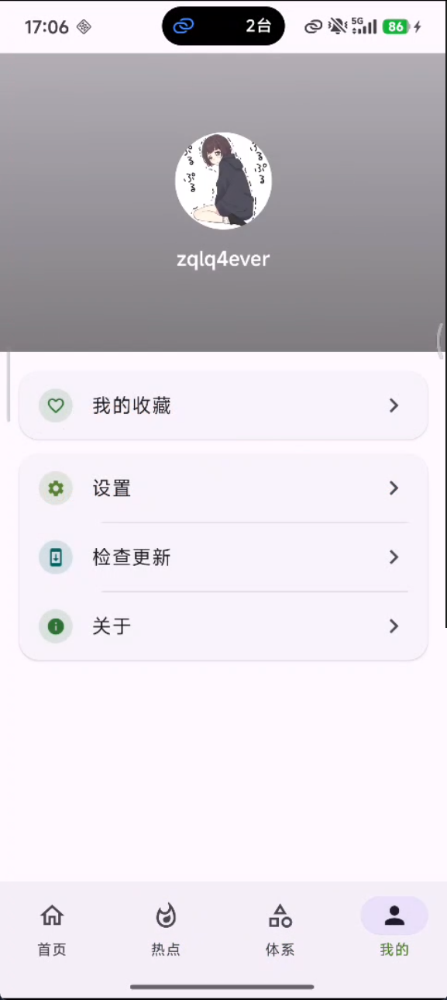
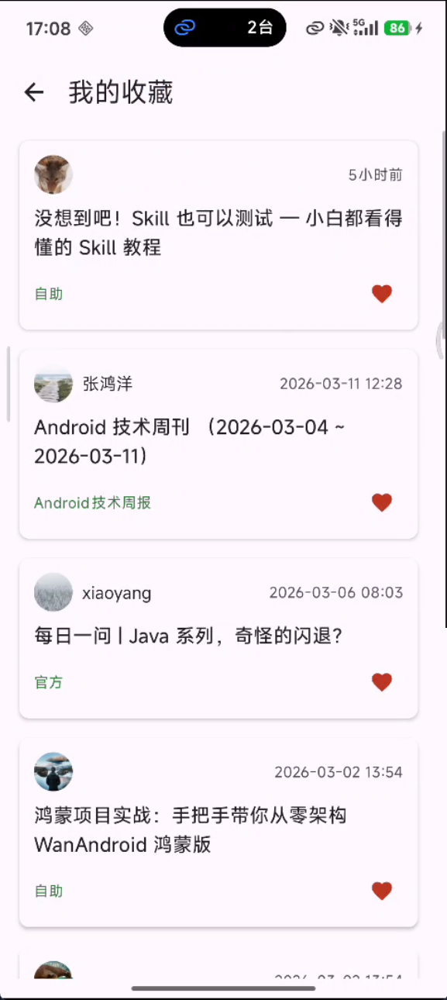
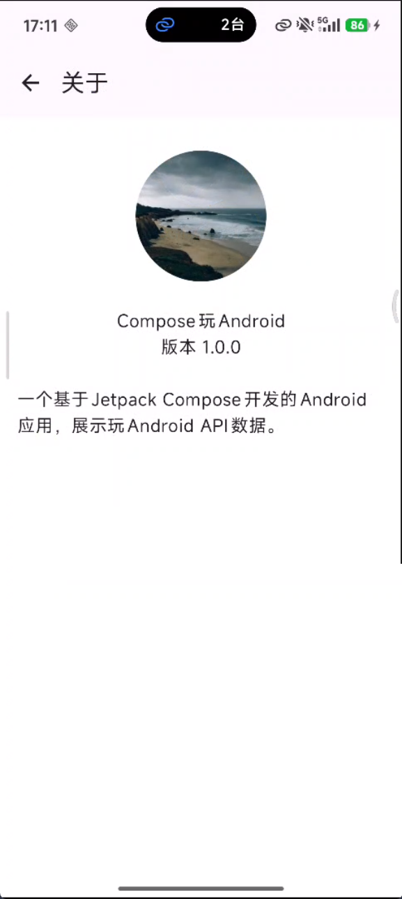
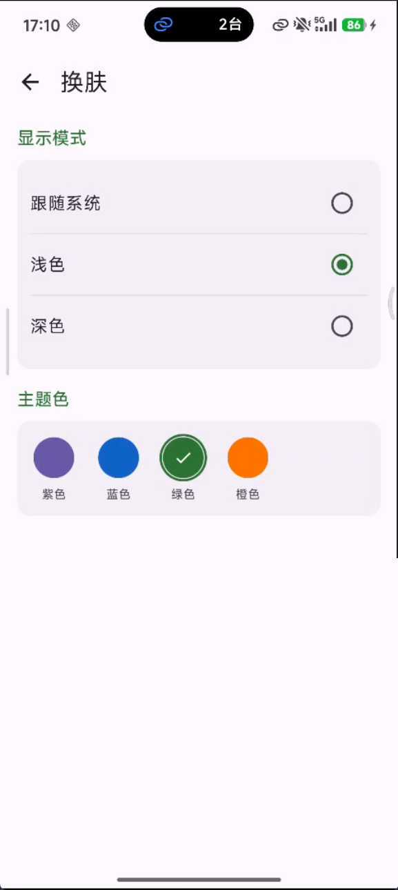

<div align="center">

# ComposeWan

基于 Kotlin 与 Jetpack Compose 的 [玩 Android](https://www.wanandroid.com/) 客户端

用于学习 Compose、Navigation 3、Koin 与 Ktor 的开源练习项目。架构参考 [CoolMallKotlin](https://github.com/Joker-x-dev/CoolMallKotlin)。

简体中文 | [English](README.en.md)

[📥 下载 APK](https://www.pgyer.com/composewan)


[](https://kotlinlang.org/)
[](https://developer.android.com/jetpack/compose)
[](https://developer.android.com/build)
[](https://developer.android.com/google/play/requirements/target-sdk)

</div>

## 功能

- **首页**：Banner + 文章列表，下拉刷新 / 上拉加载，文章收藏
- **热点**：搜索热词、常用网站
- **体系**：知识体系分类，进入子分类浏览文章
- **搜索**：关键词搜索文章
- **登录 / 注册**：玩 Android 账号登录，Cookie 持久化
- **我的**：用户信息、收藏列表、关于、设置入口
- **设置**：中英语言切换、浅色 / 深色 / 跟随系统、紫色 / 蓝色 / 绿色 / 橙色换肤、账号管理
- **文章详情**：内置 WebView 打开链接

## 截图

<div align="center">
<table>
  <tr>
    <td></td>
    <td></td>
    <td></td>
  </tr>
  <tr>
    <td align="center">首页</td>
    <td align="center">热点</td>
    <td align="center">体系</td>
  </tr>
  <tr>
    <td></td>
    <td></td>
    <td></td>
  </tr>
  <tr>
    <td align="center">搜索</td>
    <td align="center">文章详情</td>
    <td align="center">我的</td>
  </tr>
  <tr>
    <td></td>
    <td></td>
    <td></td>
  </tr>
  <tr>
    <td align="center">收藏</td>
    <td align="center">关于</td>
    <td align="center">换肤</td>
  </tr>
</table>
</div>

## 技术栈

| 类别 | 方案 | 版本 |
| --- | --- | --- |
| 语言 / 构建 | Kotlin、AGP、Gradle、Java 21 | Kotlin 2.4.10、AGP 9.3.1、Gradle 9.6.1 |
| UI | Jetpack Compose Material3、Navigation 3 | Compose BOM 2026.08.00、Nav3 1.1.1 |
| 架构 | MVI（UiState / Intent / Event）+ UseCase | — |
| 依赖注入 | Koin | 4.2.2 |
| 网络 | Ktor Client + Kotlinx Serialization | Ktor 3.5.2 |
| 图片 | Coil 3 | 3.5.0 |
| 存储 | MMKV（Cookie、主题、语言偏好） | 2.4.1 |
| 其他 | Timber、Toaster、Coroutines | — |

SDK：`minSdk 24`、`targetSdk 36`、`compileSdk 37`。

## 架构

每个 Feature 按 **Screen → ViewModel → UseCase → Repository** 分层：

```
┌─────────────┐     Intent      ┌─────────────┐
│   Screen    │ ───────────────►│  ViewModel  │
│  (Compose)  │ ◄───────────────│  UiState    │
└─────────────┘     Event       └──────┬──────┘
                                       │
                                       ▼
                                ┌─────────────┐
                                │   UseCase   │
                                └──────┬──────┘
                                       │
                                       ▼
                                ┌─────────────┐     Ktor      ┌──────────────┐
                                │ WanRepository│ ───────────► │ wanandroid.com│
                                └─────────────┘               └──────────────┘
```

- **ViewModel**：持有 `UiState`，接收 `Intent`，通过 `SharedFlow` 发送一次性 `Event`（导航、Toast）
- **UseCase**：封装业务逻辑，把网络 Bean 映射成 UI Model
- **WanRepository**：统一访问玩 Android API，Cookie 由 MMKV 持久化
- **导航**：Navigation 3 多 Back Stack，底部四个 Tab 各自保留返回栈

## 模块

```
ComposeWan
├── app                 # 应用入口、页面、ViewModel、导航
├── libs
│   ├── common          # 数据模型、MMKV、Toast、日志、用户会话
│   ├── compose         # 主题、通用 Compose 组件
│   └── network         # Ktor 封装、WanRepository（KMP commonMain）
└── gradle/libs.versions.toml
```

## 环境要求

- Android Studio Otter 或更新版本（需支持 AGP 9）
- JDK 21
- Android SDK 37

## 运行

```bash
git clone https://github.com/zqlq4ever/ComposeWan.git
cd ComposeWan
```

用 Android Studio 打开工程，同步 Gradle 后运行 `app`。命令行：

```bash
./gradlew :app:installDebug
```

Windows 使用 `gradlew.bat`。

## 接口

数据来自 [玩 Android 开放 API](https://www.wanandroid.com/blog/show/2)，Base URL：

```
https://www.wanandroid.com/
```

登录态通过 Cookie 维持，由 `MmkvCookiesStorage` 写入 MMKV。

## 致谢

- [玩 Android](https://www.wanandroid.com/) 提供开放接口
- [CoolMallKotlin](https://github.com/Joker-x-dev/CoolMallKotlin) 提供架构参考

本项目仅供学习交流。
